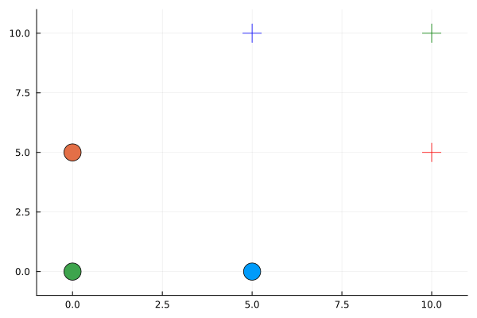

[](https://github.com/itsahmedkhalil/iLQGameSolver.jl/actions/workflows/CI.yml)
[](https://codecov.io/gh/itsahmedkhalil/iLQGameSolver.jl)
# Iterative Linear-Quadratic Game Solver for Multi-Agent Nonlinear Robotic Interactions

This repo is inspired by [ilqgames](https://arxiv.org/abs/1909.04694), efficient iterative linear-quadratic approxmiations for nonlinear multi-player general-sum differential games. 

It is still a work in progress. An example of a three point masses navigating at an intersection can be shown in the following GIF. 



## How to install for development

Go to the julia development folder `~/.julia/dev`

```bash
    cd ~/.julia/dev
```

Open the Julia REPL, enter the package manager using `]`, and run the following command to clone the code
```bash
    dev https://github.com/itsahmedkhalil/iLQGameSolver.jl.git
```

A folder called iLQGameSolver should be created and it should contain the repo. Make changes and push your code.

## Todo list:

### Todo list:


Important:

- Generalize for multiple agents:
    - Pass the dynamics function manually. Looping over each agent is inefficient. 

- Add documentation and write report

- Receding horizon for online trajectory optimization

- Make a better GUI for the results
  - Graphical represenation of the robots pose and shape in plots
  - Add TurtleBot to MeshCat or on ROS to visualize results

-  ~~Put code in .jl file instead of .ipynb~~

- ~~Integrate the linear approximation of the nonlinear dynamics for multiple agents (linearize and discretize)~~
    - ~~Check that the point mass works using both dynamics~~

- Add state constraints

- ~~Use differential drive kinematics to use on TurtleBots~~

- Check augmented lagrangian dynamic programming for equality and inequality constraints

- Monte Carlo simulations to observe Nash Equilibria solutions

